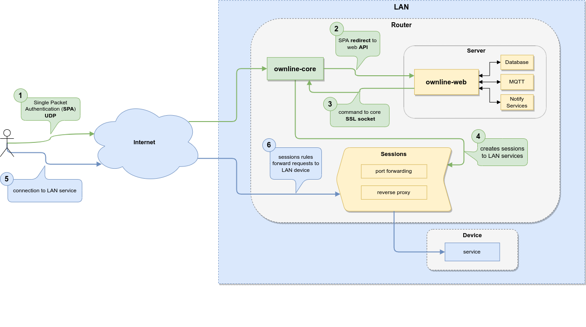
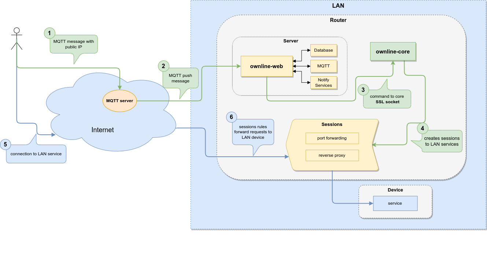

Ownline is a way to manage **remote** access to **private services** that run inside a home/office network (**LAN**).

Does this by using two forwarding techniques at different levels of the OSI model, ***"port forwarding"*** at the transport layer and ***"reverse proxy"*** at the application layer. By configuring the necessary rules with either of these two techniques, we gain access to a particular service within the LAN. Ownline abstracts these concepts and associates each of these "rules" to a user session, which is ephemeral and is linked to a public IP to allow access and a TCP/UDP port of the router to send requests to. In this way, we get temporary and IP-authenticated access to private services within our LAN from anywhere on the Internet.

Routing methods:

* **Port forwarding**: runs iptables rules directly on the router's firewall, the rule runs something like this: `iptables -t nat -I PREROUTING -s <trusted_ip>/32 -p tcp -m tcp --dport <port_dst> -j DNAT --to-destination <ip_dst>:<port_dst_lan>`\`
* **Web reverse proxy:** creates web services in nginx, which route to other web services on the LAN. The advantage of this is that you can create a single point of termination for web encryption so that you do not need to configure each service individually.

In addition, ownline also takes care of creating and updating sessions periodically in order to have constant and transparent access. It does this by obtaining the trusted IP of a user and sending it to ownline from time to time. Explained below in *"Automatic session update"*.

Ownline, is composed of 4 parts or modules:

* **ownline-core**: creates the necessary rules to access LAN services, runs on the router, executes two services:
  * **SPA**: UDP server that waits for encrypted and authenticated messages from a public IP to allow access/sessions to services. These messages are redirected to ownline-web.
  * **CMD**: server that receives commands via SSL sockets and is responsible for creating, deleting or modifying port forwarding or web proxy rules.
* **ownline-web**: Flask web server that may or may not run on the router. It contains the logic and data of users, services, sessions, etc. This is where the actions to create a session are triggered. It does this by sending commands to ownline-core via SSL sockets with which session creation and deletion messages are exchanged. It can also use MQTT and SPA to listen for automatic updates of users' public IPs. It requires a relational database. It also uses notification services such as system logs or telegram.
* **ownline-pwa:** progressive web app to visuallize all services, create new sessions, access them, etc and also MQTT web client. Needs **ownline-web** as API backend. Runs as an app in the mobile or desktop.
* **ownline-app**: Flutter android app. Runs at personal mobile device that wants automatic session creation. Sends messages periodically (\~15min) in background to your home router (SPA) or public server (MQTT).

## Automatic session update

The automatic session update is implemented in two different ways, which may or may not work at the same time:

* **SPA**: Single Packet Autentication. (*Recommended*) ownline-core runs a UDP server that waits for encrypted messages from trusted IPs, validates this message and forwards it to ownline-web to trigger an automatic session update for a user.
  * Disadvantages: needs an open UDP port on the router.
  * Advantages: no external server is required, the trusted IP is obtained from the IP header itself and not from the message.
* **MQTT**: ownline-web listens on an MQTT channel to receive public IP updates from a user.
  * Disadvantages: it needs a public server, the IP must be obtained at the client with third party services and sent in the message, so sometimes it may not match the real public IP that arrives at the home router and therefore not get access.
  * Advantages: no need to open an UDP port on the router.

### SPA flow diagram

### MQTT flow diagram

