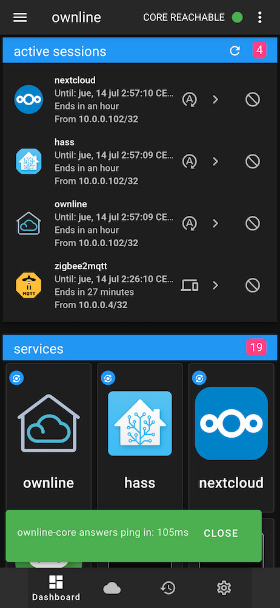
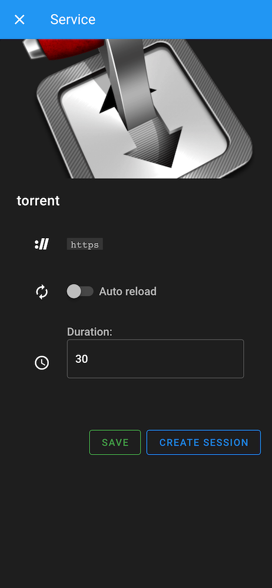
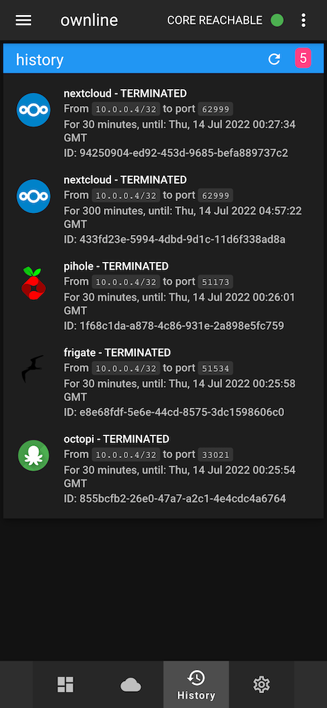
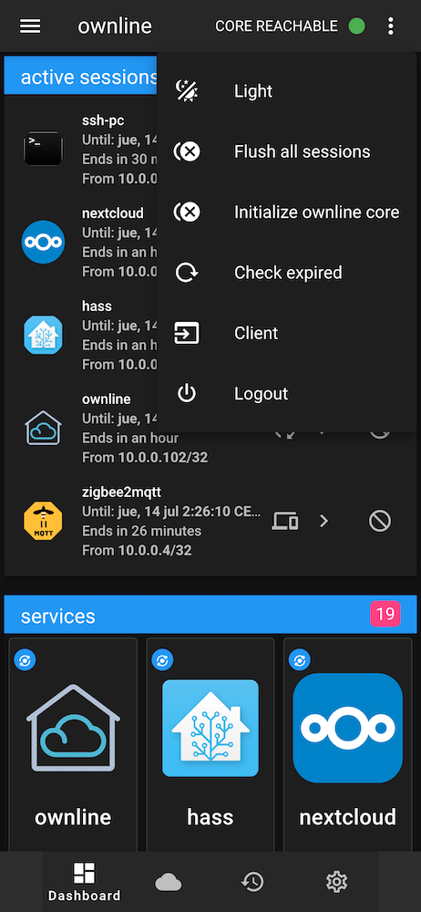
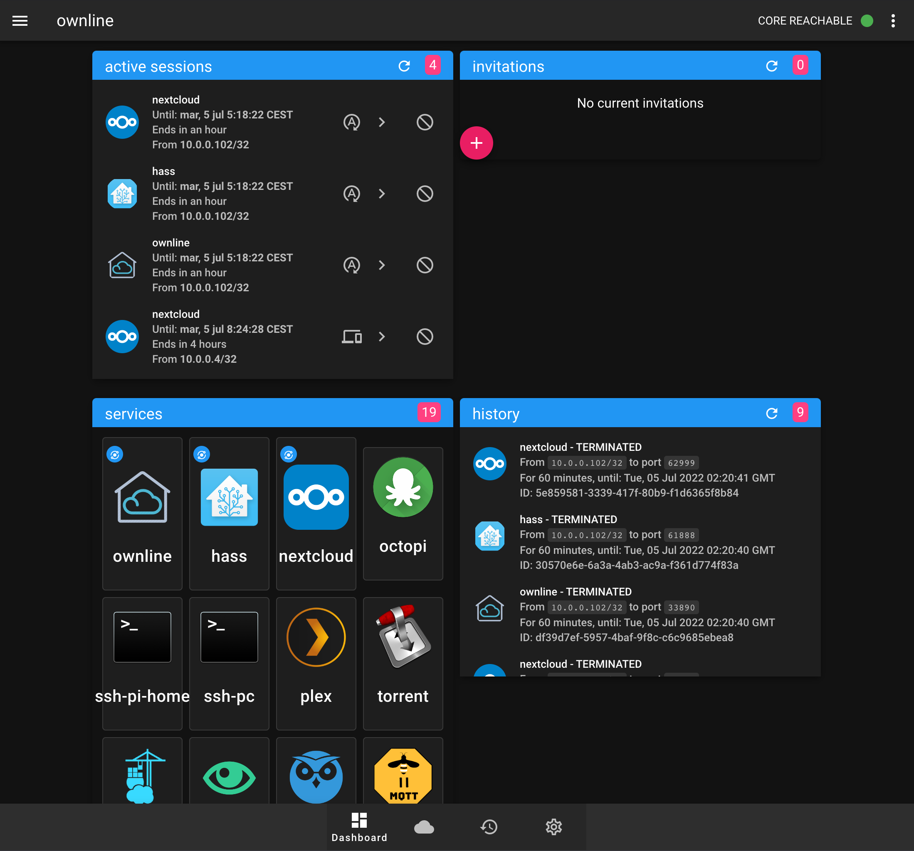

*Ownline* is a way to manage on-demand and automatic **authorized connections** to **private services** running within a local home/office network (**LAN**).

Does this by using forwarding techniques at different levels of the OSI model, ***port forwarding*** at the transport layer and ***reverse proxy*** at the application layer. By configuring the necessary rules with either of these two techniques, we gain access to a particular services within the LAN from the outside (WAN). *Ownline* abstracts these concepts and associates each of these "rules" to **ephemeral** user **sessions**, which are linked to a public IP to allow access and a TCP/UDP port of the router to send requests to. In this way, we get **temporary** and **IP authenticated** access to private services from anywhere on the internet.

### Routing methods:

* [Port forwarding](https://en.wikipedia.org/wiki/Port_forwarding): Runs iptables rules directly on the router's firewall to open NAT port forwarding from the trusted public IP/port to the private LAN IP/port. Sample: `iptables -t nat -I PREROUTING -s <trusted_ip>/32 -p tcp -m tcp --dport <port_dst> -j DNAT --to-destination <ip_dst>:<port_dst_lan>`.
* [Reverse proxy](https://en.wikipedia.org/wiki/Reverse_proxy): Creates web services in [nginx](https://www.nginx.com/), which route (proxy) to other web services on the LAN, also needs to run a new firewall rule to open the service port at the router for the specific source IP. One advantage is to be able to use a single point of termination of the web encryption and diferent sub-domains for each service, like: `https://service_name.domain.com:9999`.

Also takes care of creating and updating sessions periodically in order to have constant and transparent access to desired services. It does this by obtaining the user trusted IP and sending it to ownline from time to time. Explained below in *"Automatic session update"*.

## Modules

Ownline is divided into 4 parts or modules (go to each repo for more info):

* **[ownline-core](https://github.com/pmdp/ownline-core)**: Python daemon that uses [asyncio](https://docs.python.org/3/library/asyncio.html). Creates the necessary rules to access LAN services, runs on the router, executes two separated services:
  
  - **CMD**: Server that receives commands via SSL sockets responsible for creating or deleting sessions (port forwarding or web proxy rules).
  
  - **SPA** (Optional): UDP server that waits for encrypted and authenticated messages from a public IP to allow access/sessions to services. These messages are redirected to ownline-web. Needed for automatic sessions using SPA method.

* **[ownline-web](https://github.com/pmdp/ownline-web)**: Python [Flask](https://flask.palletsprojects.com/) web server that may or may not run on the router (not recommended for some routers to avoid slowing down them). It contains the logic and data of users, services, sessions, etc. This is where session creation actions are triggered. Does this by sending commands to ownline-core where session creation and deletion messages are exchanged. Can also use MQTT (for automatic sessions method) and web SPA endpoint to listen for automatic updates of users public IPs. Requires a relational database. Also uses notification services such as system logs or telegram.

* **[ownline-pwa](https://github.com/pmdp/ownline-pwa):** [Progressive web app](https://en.wikipedia.org/wiki/Progressive_web_application) in [vue.js](https://vuejs.org/) that provide a way to visuallize all services, create new sessions, access them, etc. Needs **ownline-web** as API backend. Runs as an app in mobile or desktop, capable of offline MQTT client to gain access to automatic services (including ownline itself).

* **[ownline-app](https://github.com/pmdp/ownline-app)** (Optional): Flutter android app. Runs at personal mobile device that wants automatic session creation. Sends messages periodically (\~15min) in background to your home router (SPA) or public server (MQTT).

## Automatic session update

With automatic sessions the user have constant access to desired services without worring to create a session each time, this is useful for services that need constant access like notifications or automatic uploads.

Automatic session update is implemented in two different ways, which may or may not work at the same time:

* **SPA**: Single Packet Autentication. (*Recommended*) ownline-core runs a UDP server that waits for encrypted and signed messages from trusted IPs, validates this message and forwards it to ownline-web to trigger an automatic session update for a user.
  * Disadvantages: needs an open UDP port on the router.
  * Advantages: 
    * No external server is required
    * Trusted public IP is obtained from the IP header itself and not from the message.
* **MQTT**: ownline-web listens on an MQTT channel to receive public IP updates from a user.
  * Disadvantages:
    * It needs a public MQTT server
    * Trusted public IP must be obtained at the client using third party services like [ipify](https://www.ipify.org). Sometimes it may not match the real public IP that user have to reach home router, therefore the access is denied.
  * Advantages: no need to open an UDP port on the router.

## Requirements:

- A **router**, with the possibility of installing software on it. Runs ***ownline-core*** daemon that needs **python**, **iptables** and **nginx** to work.

- **Domain** pointing to home/office router public IP (use [ddns](https://en.wikipedia.org/wiki/Dynamic_DNS) for dynamic public IPs).

## To do

- Make it more extensible to be able to easily use other firewalls like *nftables*, *ufw* or other proxies like *caddy*.

### SPA flow diagram

### MQTT flow diagram

### Screenshots

|                                                          |                                                                |
|:--------------------------------------------------------:|:--------------------------------------------------------------:|
|  |        |
|  |  |

