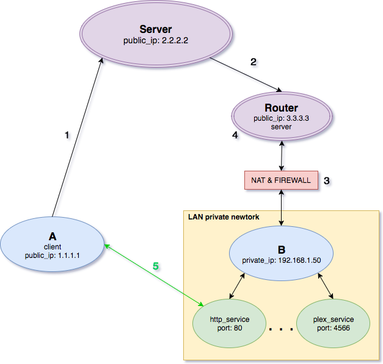

[TOC]

# ownline

## ToDo

- run daemon as a custom user with specific priviledges
- SSL sockets with certificate verification
- web interface on the server for send messages from a web UI to *ownline-service*
- tests
- Refactor client:
  - Gets server.crt, api_key, aes_key from config file

## 1. service

*ownline-service* is a **daemon** that runs on a router and listens to messages that asks connections to private LAN devices behind NAT and firewall, to make that posible, executes custom **iptables** rules at the **PREROUTING** chain.

Also provides a mechanism to remove connections rules after some time.

**4 layer security**:

- **Authorized IPs**: router server only listens to a well known ip and the nat rule only permits the client public ip that request the connection. **This keeps away lots of posible unauthorized access**.
- **SSL/TLS** encrypted TCP socket
- **AES** payload encryption.
- **API_KEY**

### 1.1 steps



1. Client A wants a connection with http_service at the 192.168.1.50 private ip
2. Server send a message to the Router using `client.py` asking for a port forwarding that will last 30 minutes:

```json
{
  "ip_src": "1.1.1.1",
  "port_dst": 7890,
  "ip_dst_lan": "192.168.1.50",
  "port_dst_lan": 80,
  "rule_timeout": 30,
  "action": "add",
  "api_key": "zzzzzzzzzzzzzzzz"
}
```
3. For that message, *ownline-service* executes:

```
-t nat -I PREROUTING -s 1.1.1.1/32 -p tcp -m tcp --dport 7890 -j DNAT --to-destination 192.168.1.50:8080
```
4. Creates a timer in a new thread for delete that rule when `rule_timeout` raises.
5. Now A can access to the specific device/service at the LAN network.

### 1.2 requirements

- **Router** with advanced firmware:
    - Like dd-wrt, openWRT, Tomato, etc
    - **python**:
        - daemons
        - sockets ssl
        - Crypto lib for AES
    - **iptables**:
        - **ACCEPT** connections from the static known server ip to the *ownline-service* listen port:
            - `-I INPUT 8 -i ppp0 -p tcp -s <known_server_ip>/32 --dport <router_destiny_port> -m state --state NEW -j ACCEPT`
- **Server**: known server with static public ip (will send messages to the router)

### 1.3 config files

Paths must be relative at  `dev` environment and absolutes at `prod` environment.

#### 1.3.1 server

For `prod` config file, create it at `config/config_server.json`

```json
{
  "host_srv" : "0.0.0.0",
  "port_srv" : 9999,
  "known_srv_ip" : "127.0.0.1",
  "ssl_key_file" : "/home/pep/dev/doorOpener/ssl_cert/server.key",
  "ssl_cert_file" : "/home/pep/dev/doorOpener/ssl_cert/server.crt",
  "log_file" : "/home/pep/dev/doorOpener/log/doorOpener.log",
  "pid_file" : "/home/pep/dev/doorOpener/doorOpener.pid",
  "aes_key" : "zzzzzzzzzzzzzzzzzzzzz",
  "api_key" : "zzzzzzzzzzzzzzzzzzzzz"
}
```

- `host_srv` is the ip where server listens on
- `port_srv` is the port where server listens on
- `known_srv_ip` is the well-known server ip
- `ssl_key_file` and `ssl_cert_file for` SSL sockets
- `log_file` where the server daemons write logs
- `pid_file` contains daemons process id, if daemons not running will not exists
- `aes_key` and `api_key` secrets for security, must been generated randomly and used by the client

#### 1.3.2 client

For `prod` config file, create it at `config/config_client.json`

```json
{
  "port_dst" : 9999,
  "host_name_dst" : "127.0.0.1",
  "ssl_cert_file" : "ssl_cert/server.crt",
  "aes_key" : "zzzzzzzzzzzzzzzzzzzzzzzzzzz",
  "api_key" : "zzzzzzzzzzzzzzzzzzzzzzzzzzz"
}
```

### 1.4 usage

````bash
# Server daemon
$ python server.py start | stop | restart [prod]

#Client
$ python client.py [-P] -m '{"ip_src":"1.1.1.1", "port_dst":6599, "ip_dst_lan": "192.168.1.3", "port_dst_lan": 8080, "action":"add", "rule_timeout": 10}'

# [prod] and [-P] are optional parameters that runs the server or client in production mode (gets prod config files and logging level)

# See server daemon log
$ tail -n 10 -f /var/log/doorOpener.log
````

```bash
# To generate the self-signed SSL key and certificate:
$ openssl genrsa -des3 -passout pass:x -out server.pass.key 2048
$ openssl rsa -passin pass:x -in server.pass.key -out server.key
$ rm server.pass.key
$ openssl req -new -key server.key -out server.csr
$ openssl x509 -req -sha256 -days 365 -in server.csr -signkey server.key -out server.crt
```

## 2. web

Servido con un contenedor **docker** con **python**, **nginx** y **mysql** servido en una ip pública estática, con un dominio asociado: *ownline.server.com*.

### 2.1 Pasos

1. Al acceder al servidor *ownline-web*, desde un dominio del tipo `doors.server.com`, aparecerá una pantalla de **login**, en la cual el usuario deberá autenticarse para poder acceder.

2. Una vez dentro, aparecerá un **dashboard** con una serie de **servicios** los cuales usará el usuario, estos se corresponden con servidores alojados en la red interna *LAN*. 

   En este paso, siempre se solicitará acceso a la API *smart-home-backend* a través de un mensaje al demonio *ownline-service* alojado en el router o gateway de la red interna y se realizará autenticación delegada para autorizar las peticiones a la API.

3. Al **clickar y solicitar** un acceso a un servicio, el servidor *ownline-web* enviará un mensaje el cuál creará una regla de acceso, permitiendo acceder desde internet a cualquiera de los servicios que existen dentro de la red interna.

   También enviará la solicitud a la API *smart-home-backend*, para que esta realice los pasos necesarios para que dicho servicio esté disponible, pasos como encender el dispositivo solicitado o activar el servicio dentro del dispositivo ya encendido.

4. El servidor responderá con un mensaje de confirmación y en el caso de ser un servicio web consumible desde el navegador se **redireccionará** al servicio solicitado abriéndolo en una nueva pestaña, en otro caso se avisará de que la sesión está disponible durante el tiempo pedido.

### 2.2 Servicios

Algunos ejemplos de servicios:

- smart-home-web: para controlar arduinos, pc, etc
- plex media server: servidor de contenido multimedia
- Nextcloud (nube privada de archivos)
- OctoPrint (control de impresora 3d)
- Tiny Tiny RSS
- IRC Chat o XMPP
- Cal DAV (calendario)
- Notes (sustituye a Google Keep)
- OpenVPN
- Git server
- Torrent server
- SMB (General file sharing)
- Tvheadend (streaming de DVB-T)

Necesita las entidades *User*, *Service* y *Session*, para poder autenticar usuarios, activar servicios, acceder a ellos durante un tiempo determinado y ver y borrar las sesiones activas.

### 2.3 Rutas & API:

#### 2.3.1 Rutas

- `/`: Si el usuario no está logrado entonces mostrará el *login*, si está logeado mostrará el *dash*
- `/login`: endpoint para el proceso de login mediante una petición POST
- `/logout`: endpoint para deslogear a un usuario borrando cookies, etc

#### 2.3.2 API

- `POST /conn/req/<service_external_id>`, solicita una conexión que crea una nueva sesión durante un tiempo
- `POST /session/remove/<session_external_id>`, borra una sesión activa
- `GET /service/`, `GET /service/<service_external_id>`, devuelve una lista de servicios o información de un servicio en concreto

### 2.4 Dockers

```dockerfile
# En general, python + requeriments + uwsgi + nginx

# Python docker
FROM python:2.7         
ADD . /todo
WORKDIR /todo
EXPOSE 5000
RUN pip install -r requirements.txt
ENTRYPOINT ["python", "app.py"]
######################
FROM ubuntu:16.04
MAINTANER Your Name "youremail@domain.tld"
RUN apt-get update -y && \
    apt-get install -y python-pip python-dev
# We copy just the requirements.txt first to leverage Docker cache
COPY ./requirements.txt /app/requirements.txt
WORKDIR /app
RUN pip install -r requirements.txt
COPY . /app
ENTRYPOINT [ "python" ]
CMD [ "app.py" ]
# docker build -t flask-tutorial:latest .
# docker run -d -p 5000:5000 flask-tutorial
######################
FROM ubuntu:14.04
# Update OS
RUN sed -i 's/# \(.*multiverse$\)/\1/g' /etc/apt/sources.list
RUN apt-get update
RUN apt-get -y upgrade
# Install Python
RUN apt-get install -y python-dev python-pip
# Add requirements.txt
ADD requirements.txt /webapp
# Install uwsgi Python web server
RUN pip install uwsgi
# Install app requirements
RUN pip install -r requirements.txt
# Create app directory
ADD . /webapp
# Set the default directory for our environment
ENV HOME /webapp
WORKDIR /webapp
# Expose port 8000 for uwsgi
EXPOSE 8000
ENTRYPOINT ["uwsgi", "--http", "0.0.0.0:8000", "--module", "app:app", "--processes", "1", "--threads", "8"]
# docker build --no-cache --rm -t travcunn/flask .
# docker run -d --cpuset-cpus 1 --name flask --restart=always travcunn/flask

######################


######################
######################
```

